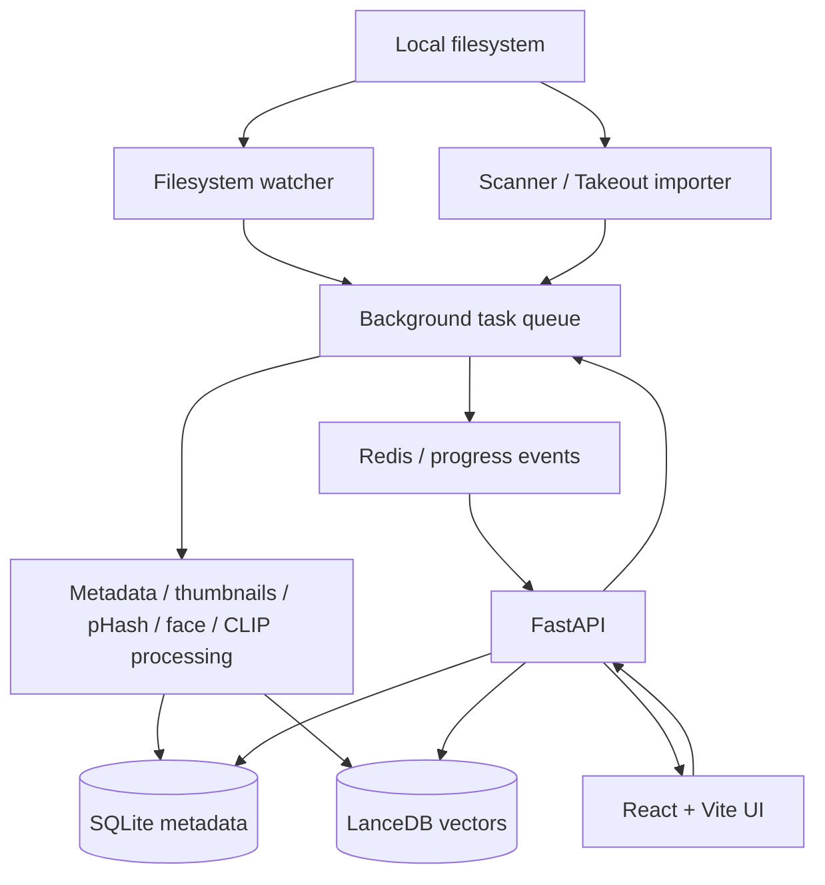

# MyPhotos

> **A self-hosted photo library for private, searchable, locally managed memories.**

MyPhotos is a Google Photos-inspired, local-first photo and video library manager. It combines a React/Vite frontend with a FastAPI backend, SQLite metadata storage, LanceDB/CLIP semantic search, background media processing, filesystem watchers, face processing, and Google Takeout import support.

The core product constraint is privacy: the application is designed to run on the user's own hardware rather than sending the photo library to a hosted service.


## What it provides

- **Virtualized timeline** for browsing large media libraries.
- **Semantic search** using CLIP embeddings and LanceDB.
- **Incremental filesystem ingestion** with SHA-256 duplicate detection.
- **Background processing** for metadata extraction, thumbnails, previews, perceptual hashes, face processing, and embeddings.
- **Filesystem watchers** for automatic synchronization of configured directories.
- **Albums and organization** with custom covers and metadata.
- **Google Takeout import** for migrating an existing photo library.
- **Real-time progress** through WebSockets and background task status.
- **Volume awareness** for local and removable storage.

## Architecture



### Data boundary

Original media files remain on the user's filesystem. The application stores metadata and references in SQLite and generated cache assets separately from the originals; semantic search data is maintained in the local vector store.

## Processing pipeline

```text
File discovered
    ↓
SHA-256 identity / duplicate check
    ↓
Metadata + EXIF extraction
    ↓
Thumbnail / preview generation
    ↓
Perceptual hash
    ↓
CLIP embedding / face processing
    ↓
SQLite + vector index
    ↓
Timeline / semantic search
```

Long-running ingestion work is moved out of the API request path so scanning and media processing can proceed independently from the UI.

## Technology

| Layer | Technology |
|---|---|
| Frontend | React 18, TypeScript, Vite, React Router, Tailwind CSS |
| Backend | FastAPI, Python 3.12+ |
| Relational data | SQLAlchemy + SQLite |
| Vector search | LanceDB + CLIP embeddings |
| Background processing | Celery + Redis |
| Media processing | Pillow, pillow-heif, imagehash and related processors |
| Realtime | WebSockets |

## Screenshots

| Timeline | Settings |
|---|---|
|  |  |

## Quick start

Requirements:

- Python 3.12+
- Node.js 18+
- npm
- Redis

```bash
git clone https://github.com/anonyxhappie/myphotos.git
cd myphotos

python -m venv .venv
source .venv/bin/activate
pip install -r requirements.txt

cd frontend
npm install
cd ..

./start.sh
```

The development stack exposes:

- Frontend: `http://localhost:5173`
- API/OpenAPI: `http://localhost:8000/docs`

## Repository layout

```text
myphotos/
├── backend/
│   ├── db/             # SQLAlchemy models, engine, and vector storage
│   ├── services/       # Background services such as filesystem watching
│   ├── celery_app.py   # Task queue configuration
│   ├── tasks.py        # Scanning and media-processing tasks
│   ├── main.py         # FastAPI API and WebSockets
│   ├── config.py       # Runtime configuration
│   └── schemas.py      # Pydantic API contracts
├── frontend/
│   └── src/            # React application
├── screenshots/        # Documentation images
├── requirements.txt
└── start.sh
```

## Data model

The central `MediaItem` model records file identity, paths, media metadata, EXIF/GPS information, processing state, and relationships to albums, tags, people, and detected faces. Volumes represent physical storage, while synced directories represent watched filesystem roots. An audit log records application actions.

## Project status

MyPhotos is an actively developed self-hosted project. It is intended primarily as a single-user local application; deployment, authentication, and network exposure should be evaluated separately before treating it as a multi-user service.

## License

See the repository for the current licensing terms.
