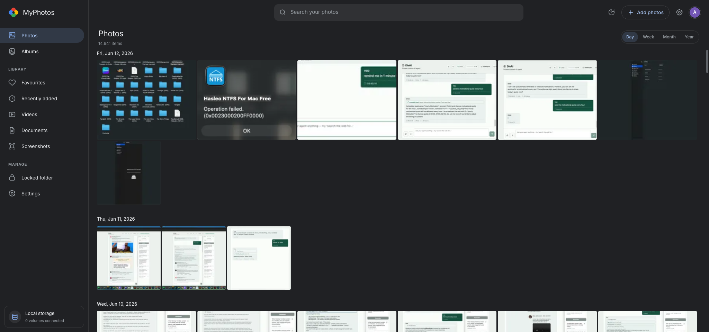
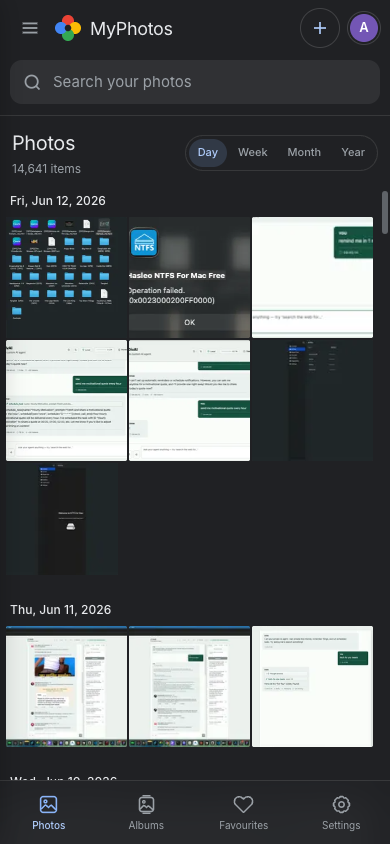
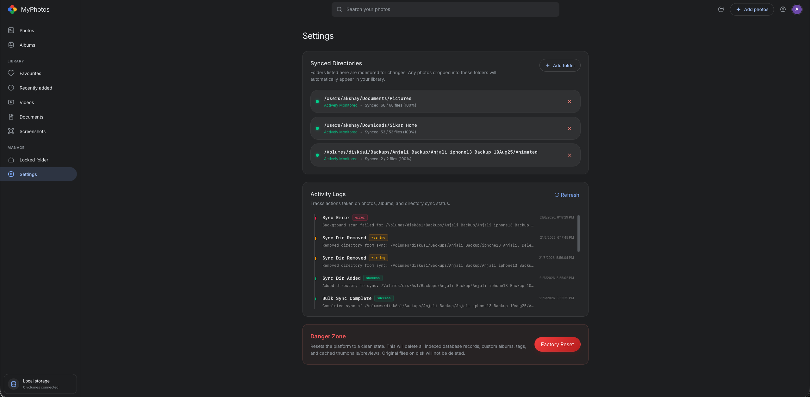

# MyPhotos



MyPhotos is a self-hosted, Google Photos-inspired photo library manager. It offers rich web aesthetics, virtualized timelines, semantic search, face/object scanning, background sync watchers, Google Takeout imports, and full album management capabilities. Keep your memories private while enjoying a modern, fast, and feature-rich viewing experience.

---

## 🌟 Features

* **Self-Hosted & Private**: Runs entirely locally on your own hardware. Your data never leaves your machine.
* **Rich Web Aesthetics**: Modern dark-first, glassmorphism UI built with React & Tailwind CSS.
* **Virtualized Timelines**: Smooth, lag-free scrolling through thousands of photos using optimized masonry layouts and `react-virtuoso`.
* **Semantic AI Search**: Find photos using natural language queries powered by LanceDB and CLIP embeddings.
* **Automated Background Sync**: Set it and forget it. Directories are actively monitored for new photos and imported automatically using Watchdog and Celery.
* **AI Processing Pipeline**: Background processing for EXIF data extraction, smart thumbnail generation, face detection, and image embedding.
* **Album Management**: Organize your media into custom albums with custom cover photos.
* **Real-Time Notifications**: Live updates on scanning progress and import statuses broadcasted via WebSockets.
* **Google Takeout Support**: Import directly from Google Takeout archives seamlessly.

### Screenshots

| Timeline | Settings |
|:---:|:---:|
|  |  |

---

## 🚀 Installation

### Prerequisites
* **Python 3.12+**
* **Node.js 18+** & **npm**
* **Redis** (used as the message broker for Celery)

### 1. Clone the Repository
```bash
git clone https://github.com/yourusername/myphotos.git
cd myphotos
```

### 2. Setup the Environment
The application uses a unified Python virtual environment.

```bash
# Create and activate virtual environment
python -m venv .venv
source .venv/bin/activate

# Install Python dependencies
pip install -r requirements.txt
```

### 3. Setup Frontend
```bash
cd frontend
npm install
cd ..
```

### 4. Start Redis
Make sure Redis is running on your system before starting the app.
* **macOS**: `brew services start redis`
* **Linux**: `sudo systemctl start redis`

### 5. Run the Application
You can launch the entire stack (FastAPI backend, Celery worker, Vite frontend) using the provided startup script:

```bash
./start.sh
```

**Access Links**:
* Frontend URL: [http://localhost:5173](http://localhost:5173)
* API OpenAPI Docs: [http://localhost:8000/docs](http://localhost:8000/docs)

---

## 🛠 Tech Stack & Architecture

### 1. Frontend
* **Core**: React 18, TypeScript, Vite.
* **Styling**: Tailwind CSS + Vanilla CSS custom design tokens (dark-first, glassmorphism).
* **Routing**: React Router (`react-router-dom`).
* **Scrolling & Virtualization**: `react-virtuoso` handles timeline and masonry scroll performance for large image libraries.

### 2. Backend
* **API Framework**: FastAPI (Python 3.12+).
* **Database & ORM**: SQLAlchemy v2 + SQLite.
* **Background Tasks**: Celery + Redis. Used for CPU-intensive file scans, EXIF extraction, thumbnail generation, face detection, and embedding computations.
* **Vector Search**: LanceDB is used to index images via CLIP (Contrastive Language-Image Pretraining) embeddings for semantic text/image searches.
* **Real-time Notifications**: WebSockets broadcast directory scanning and Google Takeout import progress in real time.

---

## 📁 Directory Structure

```text
myphotos/
├── backend/                  # FastAPI Application
│   ├── db/                   # Database & Vectors
│   │   ├── engine.py         # SQLAlchemy engine, session maker, DB setup
│   │   ├── init_db.py        # Database schema initialization
│   │   ├── models.py         # SQLAlchemy ORM models (MediaItem, Album, Volume, SyncedDirectory, AuditLog)
│   │   ├── vector.py         # LanceDB vector database setup for CLIP embeddings
│   │   └── batch.py          # Batch helpers for mass operations
│   ├── services/             # Background services
│   │   └── watcher.py        # Watches directories for changes using Watchdog
│   ├── celery_app.py         # Celery worker configuration
│   ├── tasks.py              # Celery tasks (scanning, thumbnailing, AI embedding)
│   ├── main.py               # REST API & WebSockets endpoints
│   ├── config.py             # Global app configuration & directories settings
│   └── schemas.py            # Pydantic v2 schemas (API request/response payloads)
│
├── frontend/                 # Vite + React Application
│   ├── src/
│   │   ├── api/
│   │   │   ├── client.ts     # HTTP fetch client wrapping backend endpoints
│   │   │   └── types.ts      # TypeScript interfaces mapped to Pydantic responses
│   │   ├── components/       # Core UI Components
│   │   ├── App.tsx           # Global routing and active scan status polling
│   │   └── index.css         # Styling system & custom UI variables
│   └── vite.config.ts        # Vite build tool configuration
│
├── data/                     # Data directory (created at runtime, git-ignored)
│   ├── database.db           # SQLite Database file
│   ├── lancedb/              # LanceDB files containing vector indices
│   ├── thumbnails/           # Generated cache thumbnails
│   └── previews/             # Generated cache previews
│
├── screenshots/              # UI screenshots for documentation
├── requirements.txt          # Python packages list
├── start.sh                  # Development stack launcher script
└── README.md                 # Project README
```

---

## 💾 Database Models & Relationships

Models are located in `backend/db/models.py`:
* **MediaItem**: The core entity representing a media file. Stores the hash (`sha256`), file metadata (dimensions, file size, paths), EXIF data (date taken, GPS coordinates, camera model), and scanning states (`clip_embedded`, `faces_scanned`).
* **Album**: Grouping of media items. Links to `MediaItem` via a many-to-many junction table (`media_albums`). Supports a title, description, and custom `cover_media_id`.
* **Volume**: Represents a storage disk or folder. Used to verify whether folders are online (`is_online`) or offline when managing external drives.
* **SyncedDirectory**: Holds the paths that are monitored for automatic background synchronization.
* **AuditLog**: Stores records of actions performed across the system (e.g. directory removals, file deletions, imports).

---

## ⚙️ Background Task Flow (Celery)

1. When a directory scan is triggered (`/api/scan`), FastAPI enqueues a Celery task.
2. The task reads files in the target directory, checks `sha256` to avoid duplicates, inserts items into the DB, and fires sub-tasks to generate thumbnails (`Pillow`/`pillow-heif`), compute perceptual hashes (`imagehash`), and compute CLIP embeddings.
3. Every step updates a Redis status channel.
4. The backend broadcasts these updates via WebSockets (`/api/ws/scan-progress`), which the frontend consumes to show live import metrics, speeds, and ETAs.
